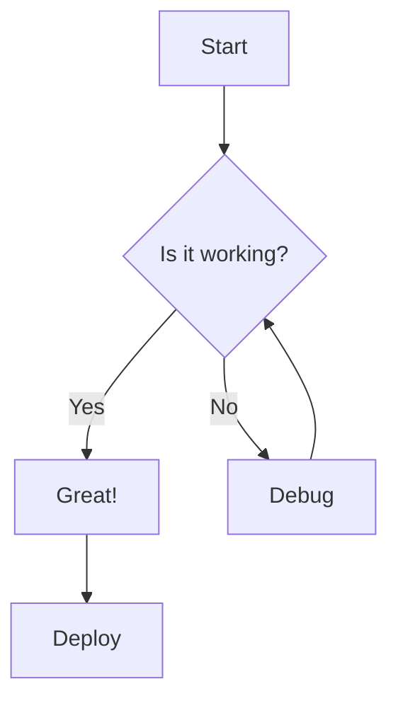
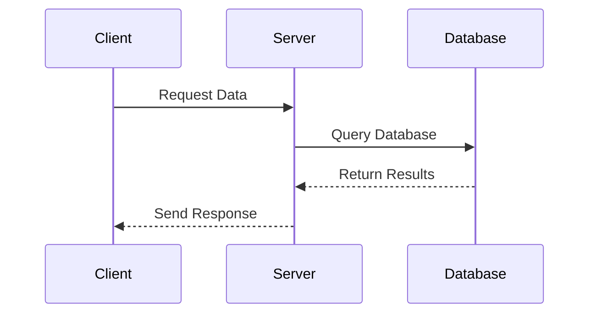
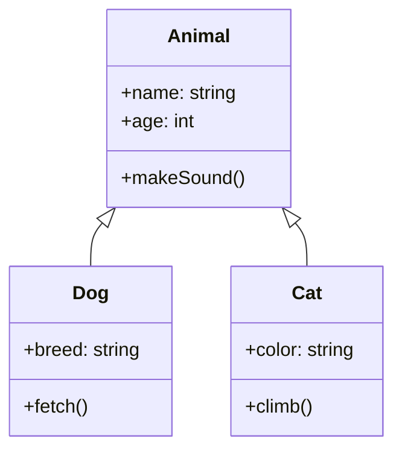
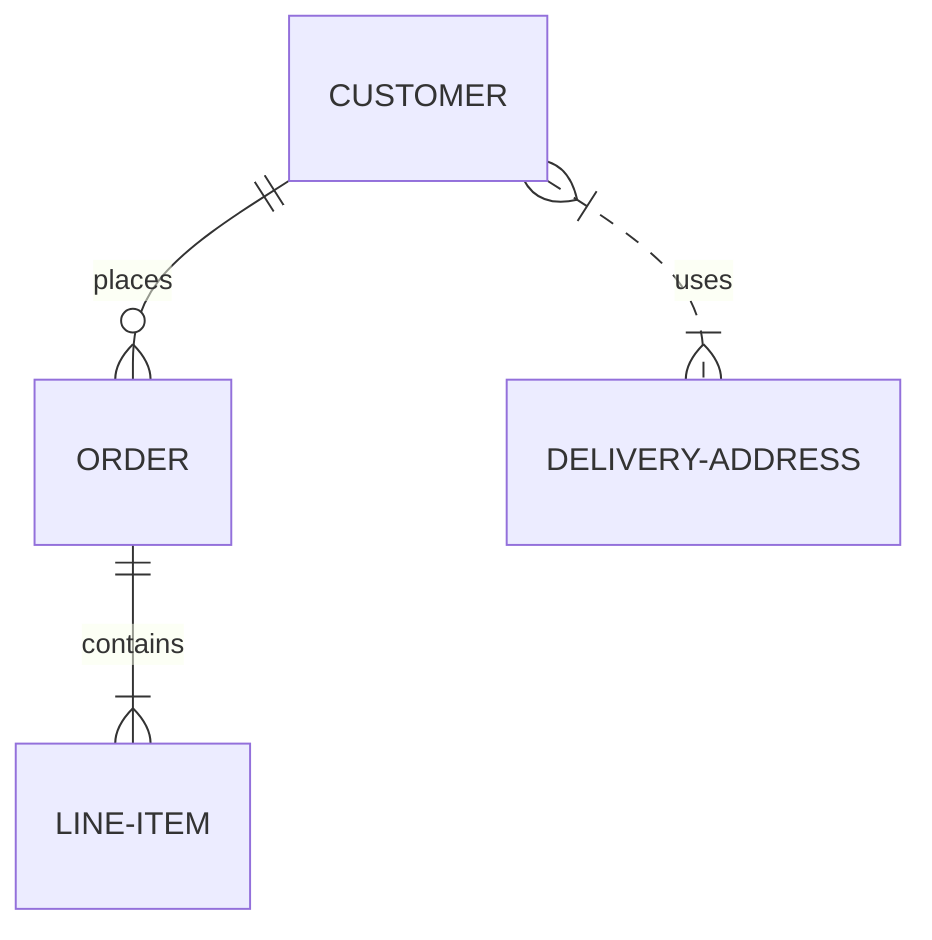
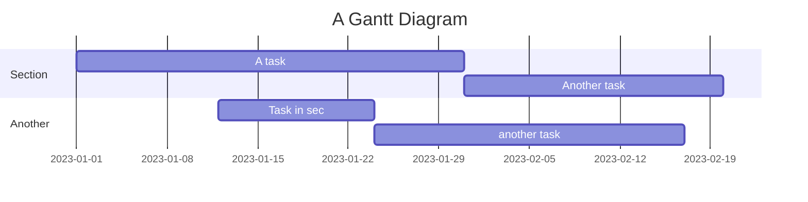
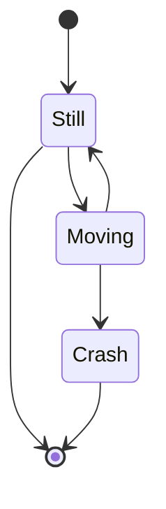
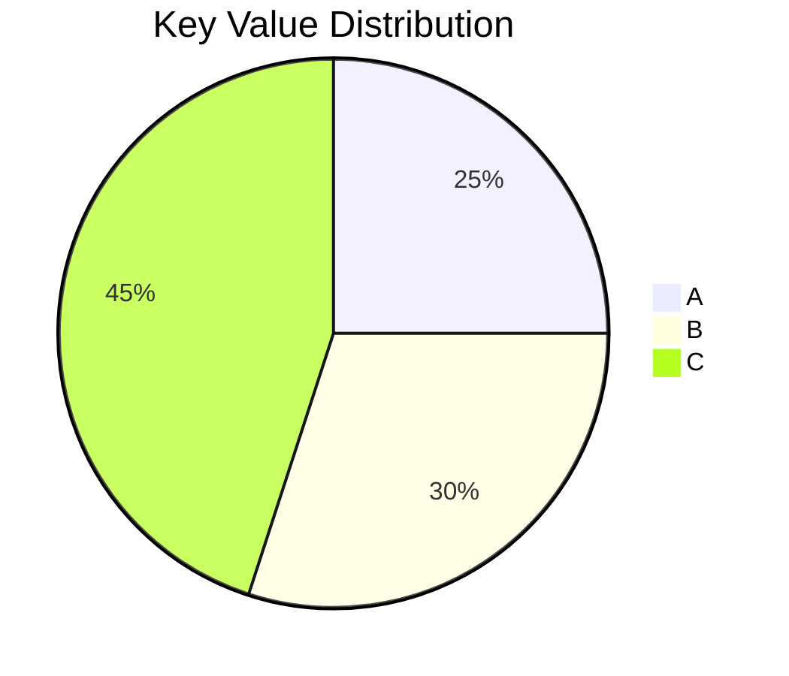

# Mermaid Diagram Examples

This page demonstrates how to use Mermaid diagrams in MDX files. Mermaid is a JavaScript-based diagramming and charting tool that renders Markdown-inspired text definitions to create diagrams dynamically.

## Basic Usage

To add a Mermaid diagram, simply use a code block with the `mermaid` language:

````markdown

````

Which renders as:


## Diagram Types

### Sequence Diagram

Sequence diagrams are useful for showing the interaction between different objects over time:



### Class Diagram

Class diagrams help visualize the structure of a system:



### Entity Relationship Diagram

ERDs are useful for database schema design:



### Gantt Chart

Gantt charts are helpful for project planning:



### State Diagram

State diagrams show how an entity changes states:



### Pie Chart

Simple pie charts to show proportions:



## Advanced Tips

- Keep diagrams simple and focused
- Use comments to explain complex parts
- Consider using colors strategically
- Break complex diagrams into smaller ones
- Use appropriate diagram types for different data structures
