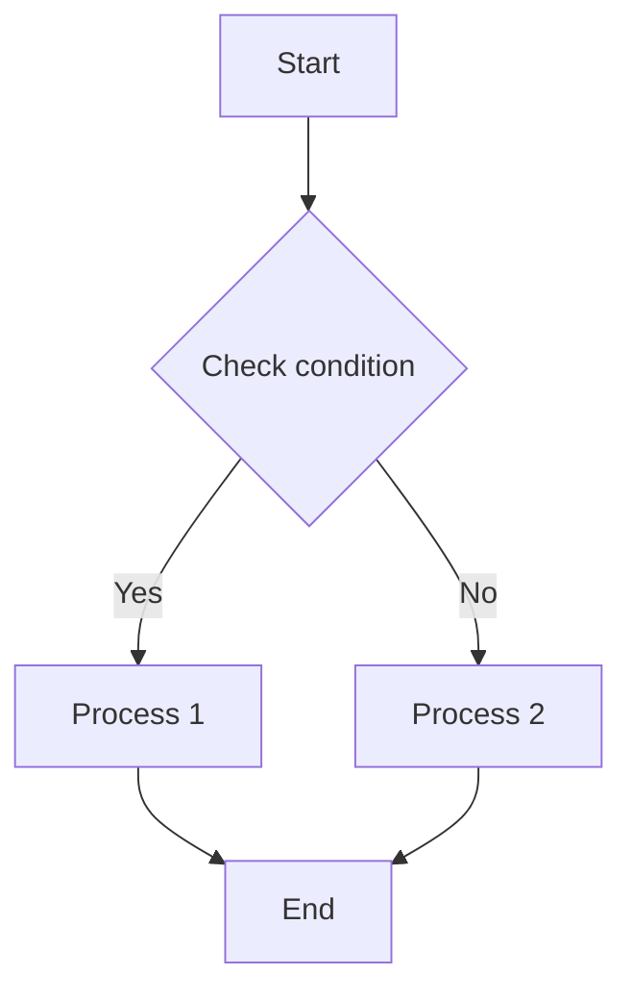

# Code Syntax Highlighting Test

Testing syntax highlighting for various programming languages.

## JavaScript

```javascript
// JavaScript example
function hello(name) {
  console.log(`Hello, ${name}!`);
  return `Nice to meet you, ${name}!`;
}

const result = hello("John");
console.log(result);

// Class example
class Person {
  constructor(name, age) {
    this.name = name;
    this.age = age;
  }

  sayHello() {
    return `Hello, my name is ${this.name} and I'm ${this.age} years old.`;
  }
}
```

## Python

```python
# Python example
def factorial(n):
    """
    Calculate factorial recursively.
    """
    if n <= 1:
        return 1
    else:
        return n * factorial(n - 1)

# Lambda function example
square = lambda x: x * x

# List comprehension
numbers = [1, 2, 3, 4, 5]
squares = [square(x) for x in numbers if x % 2 == 0]
print(squares)  # [4, 16]
```

## Java

```java
// Java example
public class HelloWorld {
    public static void main(String[] args) {
        System.out.println("Hello, World!");

        // Interface implementation example
        Greeting greeting = new Greeting() {
            @Override
            public String sayHello(String name) {
                return "Hello, " + name + "!";
            }
        };

        System.out.println(greeting.sayHello("Tom"));
    }

    interface Greeting {
        String sayHello(String name);
    }
}
```

## C++

```cpp
#include <iostream>
#include <vector>
#include <string>

// C++ example
int main() {
    std::string name = "John";
    std::cout << "Hello, " << name << "!" << std::endl;

    // Vector usage example
    std::vector<int> numbers = {1, 2, 3, 4, 5};

    // Range-based for loop
    for (const auto& num : numbers) {
        std::cout << num * num << " ";
    }

    return 0;
}
```

## Mermaid Diagram



## HTML/CSS

```html
<!doctype html>
<html lang="en">
  <head>
    <meta charset="UTF-8" />
    <title>HTML Example</title>
    <style>
      .container {
        display: flex;
        justify-content: center;
        align-items: center;
        height: 100vh;
        background-color: #f0f0f0;
      }
      .card {
        padding: 20px;
        border-radius: 8px;
        box-shadow: 0 4px 8px rgba(0, 0, 0, 0.1);
        background-color: white;
      }
    </style>
  </head>
  <body>
    <div class="container">
      <div class="card">
        <h1>Hello!</h1>
        <p>This is an HTML and CSS example.</p>
      </div>
    </div>
  </body>
</html>
```

## SQL

```sql
-- SQL example
CREATE TABLE employees (
    id INT PRIMARY KEY,
    name VARCHAR(100),
    department VARCHAR(50),
    salary DECIMAL(10, 2)
);

INSERT INTO employees (id, name, department, salary)
VALUES (1, 'John', 'Development', 5000000),
       (2, 'Tom', 'Marketing', 4500000),
       (3, 'Sarah', 'HR', 4800000);

SELECT
    department,
    AVG(salary) as avg_salary
FROM employees
GROUP BY department
HAVING AVG(salary) > 4700000
ORDER BY avg_salary DESC;
```

## JSON

```json
{
  "name": "John",
  "age": 30,
  "isMarried": false,
  "hobbies": ["Reading", "Travel", "Football"],
  "address": {
    "city": "New York",
    "district": "Manhattan",
    "zipCode": "10001"
  },
  "phoneNumbers": [
    {
      "type": "home",
      "number": "212-555-1234"
    },
    {
      "type": "mobile",
      "number": "646-555-4321"
    }
  ]
}
```

This page is an example to test syntax highlighting for various programming languages.
